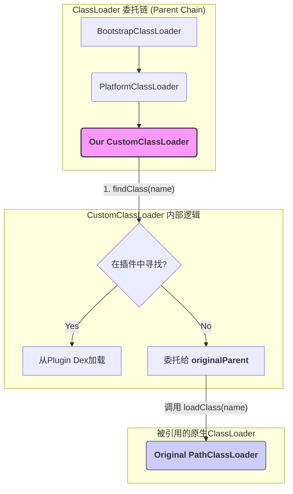

# 安卓插件化框架中的Dex管理方案深度解析

在Android插件化技术中，核心挑战之一是如何管理和加载插件的Dalvik可执行文件（Dex）。这直接关系到主应用（Host）能否正确地调用插件中的代码和资源。本文档将系统性地梳理和讲解四种主流的Dex管理方案。

---

## 方式一：完整加载独立的Dex文件 (`DexClassLoader`)

这是最经典、最基础的插件化实现方式。

### 原理
为每一个插件创建一个独立的 `DexClassLoader`，并将其 `parent` 设置为主应用的 `ClassLoader`。这形成了一个标准的双亲委派链。当加载一个类时，会先从插件自己的 `ClassLoader` 开始查找，如果找不到，再向上委托给父 `ClassLoader`（主应用）去查找。

### 优缺点
- **优点**: 实现简单，隔离性好，不同插件间不易产生类冲突。
- **缺点**: 类相互访问困难（尤其是插件访问主应用），资源管理复杂。

### 代码示例
```java
import android.content.Context;
import dalvik.system.DexClassLoader;
import java.io.File;
import java.lang.reflect.Method;

public class DexManagerV1 {
    /**
     * 使用DexClassLoader加载插件中的类并执行其方法。
     * @param context 上下文
     * @param pluginApkPath 插件APK文件的绝对路径
     * @param classNameToLoad 要加载的插件中的完整类名
     */
    public static void loadAndInvoke(Context context, String pluginApkPath, String classNameToLoad) {
        // DexClassLoader需要一个用于存放优化后dex文件的目录（odex）
        File optimizedDexOutputPath = context.getDir("dex", Context.MODE_PRIVATE);

        // 创建DexClassLoader实例
        DexClassLoader classLoader = new DexClassLoader(
                pluginApkPath,
                optimizedDexOutputPath.getAbsolutePath(),
                null,
                context.getClassLoader() // 设置父加载器
        );

        try {
            // 使用创建的ClassLoader加载插件中的目标类
            Class<?> pluginClass = classLoader.loadClass(classNameToLoad);
            // ... 后续通过反射创建实例和调用方法
        } catch (Exception e) {
            e.printStackTrace();
        }
    }
}
```

---

## 方式二：Dex文件合并（“注入”或“插桩”式）

这是当前许多主流热修复和插件化框架（如Tinker, RePlugin）采用的核心技术。

### 原理
通过Java反射，获取到主应用 `ClassLoader`（通常是`PathClassLoader`）内部的 `pathList` 字段，再从 `pathList` 中获取 `dexElements` 数组。然后，将插件的Dex文件也解析成 `Element` 对象，将主应用和插件的 `dexElements` 数组合并成一个新数组，最后通过反射写回 `pathList` 中。

### 优缺点
- **优点**: 无缝访问，插件类和主应用类在同个`ClassLoader`中，可直接调用。通过调整合并顺序可实现热修复。
- **缺点**: 实现复杂，需处理大量反射和Android版本兼容性问题。隔离性差，可能存在类冲突。

### 代码示例
```java
import android.content.Context;
import dalvik.system.DexClassLoader;
import dalvik.system.PathClassLoader;
import java.io.File;
import java.lang.reflect.Array;
import java.lang.reflect.Field;

public class DexManagerV2 {
    /**
     * 将插件的dex文件注入到宿主的ClassLoader中。
     */
    public static void mergeDex(Context context, String pluginApkPath) throws Exception {
        // 1. 获取宿主的ClassLoader
        PathClassLoader hostClassLoader = (PathClassLoader) context.getClassLoader();

        // 2. 通过反射获取宿主的dexElements数组
        Object hostDexElements = getDexElements(getPathList(hostClassLoader));

        // 3. 创建临时ClassLoader来加载插件dex，并从中获取dexElements
        File optimizedDexDir = context.getDir("temp_dex", Context.MODE_PRIVATE);
        DexClassLoader pluginClassLoader = new DexClassLoader(pluginApkPath, optimizedDexDir.getAbsolutePath(), null, hostClassLoader);
        Object pluginDexElements = getDexElements(getPathList(pluginClassLoader));

        // 4. 合并两个dexElements数组
        Object combinedDexElements = combineArray(pluginDexElements, hostDexElements); // 插件的放前面

        // 5. 将新数组反射写回宿主ClassLoader
        setField(getPathList(hostClassLoader), "dexElements", combinedDexElements);
    }

    // ... 此处省略 combineArray, getPathList, getDexElements, setField 等反射工具方法 ...
}
```

---

## 方式三：利用系统原生的MultiDex加载方案

此方案是对系统`MultiDex`机制的一种借鉴和利用。

### 原理
- **Android 5.0及以上**: ART虚拟机原生支持从APK中加载多个Dex文件（`classes.dex`, `classes2.dex`...）。
- **Android 5.0以下**: 官方`MultiDex`兼容库通过与**方式二**相同的反射注入技术，将非主Dex的`Elements`注入到`ClassLoader`中。

插件化框架可以模仿`MultiDex`的行为，将插件的Dex路径动态添加到`ClassLoader`的已知路径列表中，让系统自己去加载和管理，本质上仍是方式二技术的应用。

---

## 方式四：自定义ClassLoader并代理原生ClassLoader

这是一种更高级、控制力更强的方案。

### 原理
创建一个继承自`PathClassLoader`的`CustomClassLoader`。在应用启动早期，通过反射将系统中`LoadedApk`引用的原生`ClassLoader`替换为我们自定义的实例。这个`CustomClassLoader`重写`findClass`方法，改变类加载逻辑：
1.  优先从自己管理的插件列表中查找类。
2.  如果找不到，再委托给其持有的**原生`ClassLoader`实例**去加载（加载宿主类）。
3.  如果原生`ClassLoader`也找不到，再向上委托给`super`（即`PlatformClassLoader`）去加载（加载系统类）。

### 优缺点
- **优点**: 控制力最强，逻辑清晰，可以实现插件隔离、动态加卸载等复杂需求。
- **缺点**: 实现难度极高，替换系统`ClassLoader`的操作兼容性风险极大，稳定性较差。

### 代码示例
```java
public class DexManagerV4 {
    public static class CustomClassLoader extends PathClassLoader {
        private final List<DexFile> pluginDexFiles = new ArrayList<>();
        private final ClassLoader originalParent;

        public CustomClassLoader(String dexPath, ClassLoader parent) {
            // 关键点：将自己的父加载器设置为原生加载器的父加载器
            super(dexPath, parent.getParent()); 
            this.originalParent = parent;
        }

        @Override
        protected Class<?> findClass(String name) throws ClassNotFoundException {
            // 1. 优先从插件中查找
            for (DexFile dexFile : pluginDexFiles) {
                Class<?> clazz = dexFile.loadClass(name, this);
                if (clazz != null) return clazz;
            }
            // 2. 插件中找不到，委托给原生ClassLoader去加载宿主类
            try {
                 return originalParent.loadClass(name);
            } catch (ClassNotFoundException e) {
                // 3. 如果都找不到，向上抛出，最终会走到父加载器（PlatformClassLoader）
                throw e;
            }
        }
    }
    // ... 此处省略注入CustomClassLoader到系统中的高风险反射代码 ...
}
```

---

## 深度解析：`CustomClassLoader`的`super()`调用

在方式四中，`super(dexPath, parent.getParent());`这行代码是理解其工作模式的核心。

- **`parent`是什么？** 是我们通过反射拿到的**原生`PathClassLoader`**实例。
- **`parent.getParent()`是什么？** 是原生`PathClassLoader`的父加载器，即**`PlatformClassLoader`**。
- **这行代码做了什么？** 它在构造我们的`CustomClassLoader`时，直接将其委托链的上一级设置为`PlatformClassLoader`，从而把自己完美地“插入”到了原生`PathClassLoader`和`PlatformClassLoader`之间。

### 注入后的ClassLoader关系图


这个设计通过“偷天换日”，让`CustomClassLoader`既能优先加载插件，又能通过持有的原生`ClassLoader`实例去加载宿主类，还能通过正确的`parent`链去加载系统类。

---

## 四种方案对比总结

| 特性 | 方式一 (`DexClassLoader`) | 方式二 (Dex注入) | 方式三 (利用MultiDex) | 方式四 (自定义ClassLoader) |
| :--- | :--- | :--- | :--- | :--- |
| **核心思想** | 为插件创建独立Loader | 向原生Loader注入Dex | 模仿系统加载多Dex | 用自定义Loader替换原生Loader |
| **隔离性** | **强** | **弱** | **弱** | **可控** (可设计为强或弱) |
| **类访问** | 隔离，通信复杂 | 无缝，直接调用 | 无缝，直接调用 | 无缝，直接调用 |
| **实现复杂度**| 低 | 高 | 高 | **极高** |
| **灵活性** | 低 | 中 | 中 | **极高** |
| **稳定性** | **高** | 中 (依赖内部API) | 中 (依赖内部API) | **低** (依赖核心内部API) |

